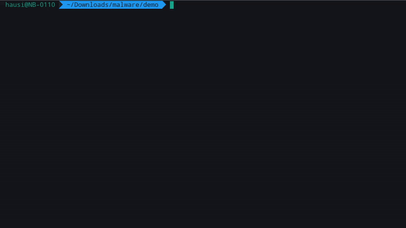
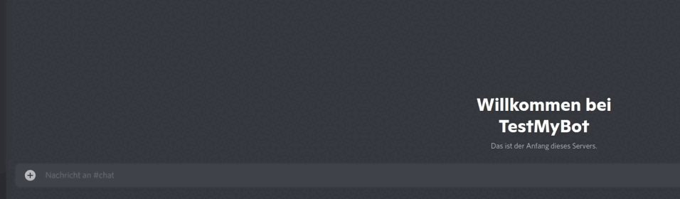

# Verdict-as-a-Service

*Verdict-as-a-Service* (VaaS) is a service that provides a platform for scanning files for malware and other threats. It allows easy integration in your application. With a few lines of code, you can start scanning files for malware. 

## Integration of Malware Detection

Easily integrate malware detection into **any kind** of application, service or platform.

Create a command line scanner to find malware with a few lines of code: [Example](rust/examples/gscan)

Create a KDE Dolphin plugin to scan for malicious content with a few lines of code: [Example](rust/examples/kde_dolphin)

Create a WordPress plugin that scans all file uploads for malware with a few lines of code: [Example](php/examples/wordpress)

Create a Discord bot that scans and deletes malicious files uploaded on your Discord server with few lines of code: [Example](typescript/examples/discordbot)

## I'm interested in VaaS

You need credentials to use the service in your application. If you are interested in using VaaS, please [contact us](mailto:oem@gdata.de).

## SDKs

At the moment SDKs for [Rust](./rust/), [Java](./java/), [Typescript](./typescript/), [Microsoft .NET](./dotnet/), [Python](./python/), [PHP](./php/) and [Ruby](./ruby/) are available.

|Functionality|Rust|Java|PHP|TypeScript|.NET|Python|Ruby|
|---|---|---|---|---|---|---|---|
|Check SHA256|&#9989;|&#9989;|&#9989;|&#9989;|&#9989;|&#9989;|&#9989;|
|Check SHA256 list|&#9989;|&#9989;|&#10060;|&#9989;|&#9989;|&#10060;|&#10060;|
|Check URL|&#9989;|&#9989;|&#9989;|&#9989;|&#9989;|&#9989;|&#9989;|
|Check file|&#9989;|&#9989;|&#9989;|&#9989;|&#9989;|&#9989;|&#9989;|
|Check file list|&#9989;|&#9989;|&#10060;|&#9989;|&#9989;|&#10060;|&#10060;|
|Custom Guids for tracability on user side|&#10060;|&#10060;|&#9989;|&#10060;|&#10060;|&#10060;|&#10060;|

### Documentation

Documentation for the SDKs is available in the corresponding SDK folder.

* [Rust SDK](./rust/), [Examples](./rust/examples)
* [Java SDK](./java/)
* [PHP SDK](./php/), [Examples](./php/examples)
* [TypeScript SDK](./typescript/)
* [Python SDK](./python/)
* [.NET SDK](./dotnet/)
* [Ruby SDK](./ruby/)

### Planned SDKs

The following SDKs are planned but not yet available: *Swift* and *Perl*. If you need SDKs for other languages, please create an issue or contribute an SDK with a pull request.
