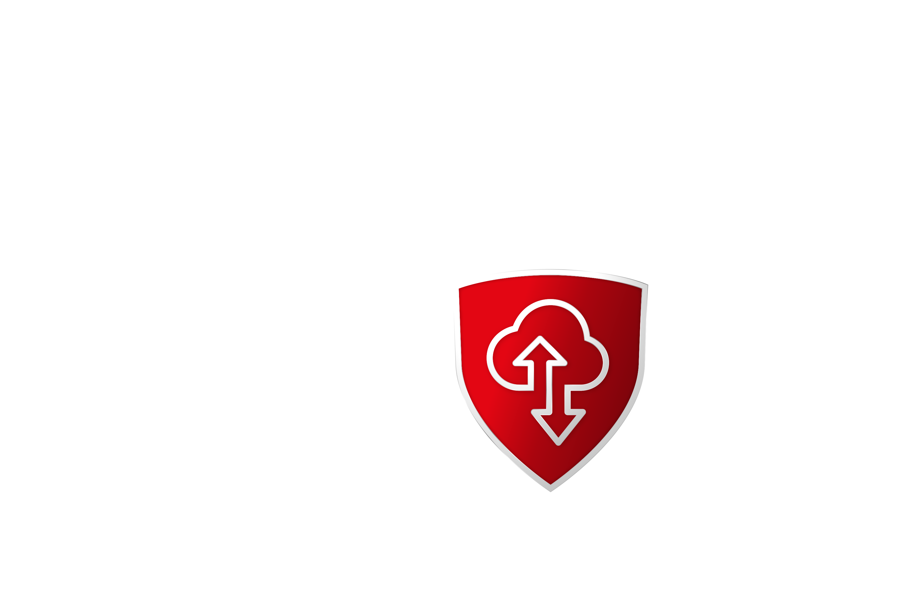

[](https://github.com/GDATASoftwareAG/vaas/actions/workflows/ci-dotnet.yaml)
[](https://github.com/GDATASoftwareAG/vaas/actions/workflows/ci-rust.yaml)[](https://github.com/GDATASoftwareAG/vaas/actions/workflows/ci-typescript.yaml)
[](https://github.com/GDATASoftwareAG/vaas/actions/workflows/ci-ruby.yaml)
[](https://github.com/GDATASoftwareAG/vaas/actions/workflows/ci-java.yaml)
[](https://github.com/GDATASoftwareAG/vaas/actions/workflows/ci-python.yaml)
[](https://github.com/GDATASoftwareAG/vaas/actions/workflows/ci-php.yaml)
[](https://github.com/GDATASoftwareAG/vaas/actions/workflows/ci-golang.yaml)

# Verdict-as-a-Service



*Verdict-as-a-Service* (VaaS) is a cloud service that provides capabilities to scan files for malware and other threats. It allows you to easily integrate malware detection in your application with a few lines of code. You can use VaaS to secure any scenario where a file is exchanged or stored, such as:

- Upload forms with file submissions
- Collaboration software like MS Teams, Nextcloud or Slack
- Backup and distributed file storage like Dropbox or OneDrive

With minimal effort, you can check a file, URL or hashsum for malicious content. No local installation of any anti-malware product is necessary. VaaS works out of the box, by providing detections from the G DATA cloud. Hosting VaaS on your own Kubernetes cluster, is an option as well.

Simple example in Rust. Check below for more programming languages.

```rust
use vaas::{error::VResult, CancellationToken, Vaas, VaasVerdict};
use vaas::auth::authenticators::ClientCredentials;
use std::convert::TryFrom;
use std::time::Duration;

#[tokio::main]
async fn main() -> VResult<()> {
    // Cancel the request after 10 seconds if no response is received
    let ct = CancellationToken::from_seconds(10);

    // Authenticate and create VaaS instance
    let authenticator = ClientCredentials::new(CLIENT_ID, CLIENT_SECRET);
    let vaas = Vaas::builder(authenticator).build()?.connect().await?;

    // Open a file we want to check
    let file = std::path::PathBuf::from("myfile");

    // Ask VaaS for a verdict
    let verdict = vaas.for_file(&file, &ct).await?;

    // Prints "Clean", "Pup" or "Malicious"
    println!("{}", verdict.verdict);
    Ok(())
}
```

## How to get started with VaaS
If you are interested in trying out VaaS, you can sign up on our website to create a free trial account. Visit our registration page and follow the instructions to get started. If you have a business case or specific requirements, please contact us at oem@gdata.de to discuss your needs and explore how VaaS can best fit your organization.

## SDKs
We provide SDKs for various programming languages to make it easy for you to integrate VaaS in your application. You can find the source code, examples, and documentation for each SDK in the corresponding repository. Currently, we support the following languages:

|Language|Source Code|Examples|Documentation|Repository|
|--------|-----------|--------|-------------|----------|
|Rust|[Rust SDK](./rust/)| [Examples](./rust/examples)| [docs.rs](https://docs.rs/vaas/latest/vaas/) | [crates.io](https://crates.io/crates/vaas) | 
|Java|[Java SDK](./java/)|[Examples](./java/examples)| [Readme](https://github.com/GDATASoftwareAG/vaas/blob/main/java/Readme.md) | [maven central](https://mvnrepository.com/artifact/de.gdata/vaas)|
|PHP|[PHP SDK](./php/)|[Examples](./php/examples)||[packagist](https://packagist.org/packages/gdata/vaas)|
|TypeScript|[TypeScript SDK](./typescript/)|[Examples](./typescript/examples)|[Readme](https://github.com/GDATASoftwareAG/vaas/blob/main/typescript/Readme.md)|[npmjs](https://www.npmjs.com/package/gdata-vaas)
|Python|[Python SDK](./python/)|[Examples](./python/examples)|[Readme](https://github.com/GDATASoftwareAG/vaas/blob/main/python/README.md)|[pypi](https://pypi.org/project/gdata-vaas/)|
|.NET|[.NET SDK](./dotnet/)|[Examples](./dotnet/examples)||[nuget.org](https://www.nuget.org/packages/GDataCyberDefense.Vaas)|
|Ruby|[Ruby SDK](./ruby/)|[Examples](./ruby/examples)|[Reamde](https://github.com/GDATASoftwareAG/vaas/blob/main/ruby/README.md)|[rubygems](https://rubygems.org/gems/vaas)|
|Go|[Go SDK](./golang/vaas/)|[Examples](./golang/examples)|[Readme](https://github.com/GDATASoftwareAG/vaas/blob/main/golang/vaas/README.md)|[Github](https://github.com/GDATASoftwareAG/vaas/tree/main/golang/vaas)|
|C++|[C++ SDK](./cpp/)||[Readme](https://github.com/GDATASoftwareAG/vaas/blob/main/cpp/README.md)|[Github](https://github.com/GDATASoftwareAG/vaas/tree/main/cpp)|

The following table shows the functionality supported by each SDK:

|Functionality|Rust|Java|PHP|TypeScript|.NET|Python|Ruby|Golang|C++|
|---|---|---|---|---|---|---|---|---|---|
|Check SHA256|&#9989;|&#9989;|&#9989;|&#9989;|&#9989;|&#9989;|&#9989;|&#9989;|&#9989;|
|Check SHA256 list|&#9989;|&#9989;|&#10060;|&#9989;|&#9989;|&#10060;|&#10060;|&#9989;|&#10060;|
|Check URL|&#9989;|&#9989;|&#9989;|&#9989;|&#9989;|&#9989;|&#9989;|&#9989;|&#10060;|
|Check file|&#9989;|&#9989;|&#9989;|&#9989;|&#9989;|&#9989;|&#9989;|&#9989;|&#9989;|
|Check file list|&#9989;|&#9989;|&#10060;|&#9989;|&#9989;|&#10060;|&#10060;|&#9989;|&#10060;|
|Custom Guids for tracability on user side|&#10060;|&#10060;|&#9989;|&#10060;|&#10060;|&#9989;|&#10060;|&#10060;|&#10060;|


## Integration Ideas for Malware Detection trough VaaS
You can use VaaS to create various applications that scan for malicious content with a few lines of code. Here are some examples:

- [WordPress Plugin](https://wordpress.org/plugins/gdata-antivirus/) to scan for malware in uploaded files
- [Nextcloud App](https://apps.nextcloud.com/apps/gdatavaas) to scan files in your Nextcloud instance

## Build & Test

The easiest way to build and test the SDKs is with the [Nix Package Manager](https://nixos.org/download/#download-nix) and the provided [Just](https://github.com/casey/just) file. Nix will take care of all dependencies and Just provides a simple interface to run the most common tasks.

To build and test the SDKs, run the following command:

```bash
# switch into a development shell with all dependencies installed.
# This will not alter your system, but provide a shell with all necessary tools.
nix develop

# Now use the Just tool to run the most common tasks
just -l # list all available tasks

# Just Examples
# Run the tests for the Rust SDK
just test-rust
```

There are `test-*`, `build-*`, `clean-*` and `release-*` tasks for each SDK, with the exception of Python and PHP, where no build task is available. You can also run the tests for all SDKs with `just test-all`. A `build-all` and `clean-all` task is available as well.

The `release-*` task triggers a Github Action to build and release a new version of the specified SDK. It needs a version number as an argument, which is used to tag the release. The version number should follow the [Semantic Versioning](https://semver.org/) scheme.

```bash
# Example: Release the Rust SDK with version 0.1.0
just release-rust 0.1.0
```

As the SDKs need credentials to authenticate to the VaaS API. You need to provide them in a `.env` file. Copy your `.env` file into the root directory of the project. The C++ SDK needs special credentials, which you can provide in a `.cpp.env` file.

```bash
# Copy the .env and .cpp.env file to all SDK folders
# to be able to run the integration tests
just populate-env

