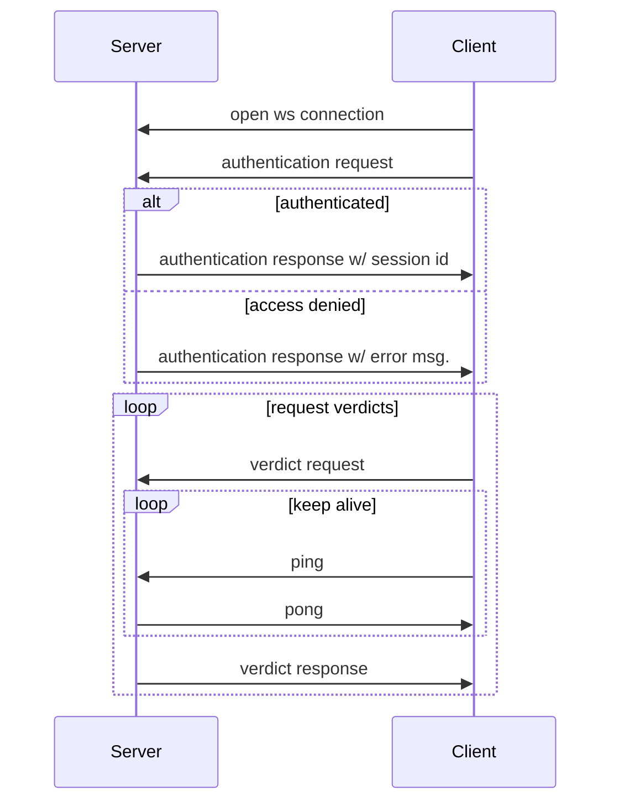
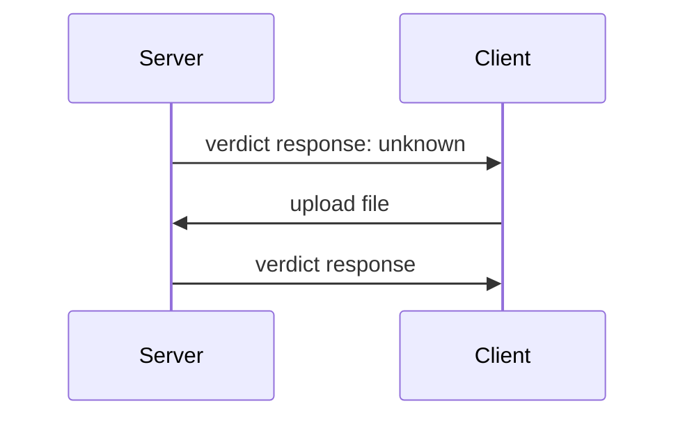
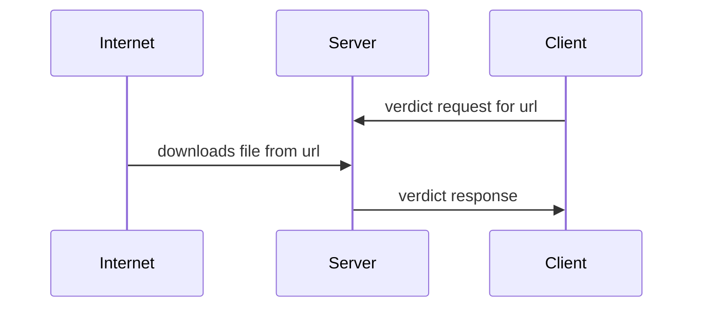

# VaaS Websocket Protocol

    This document describes the VaaS Websocket Protocol. All SDKs have to implement this protocol to be able to use the VaaS Websocket API.

    Protocol version: 0.1.0

## Protocol Internals   

Verdict-as-a-Service is based on a WebSocket protocol. The sequence diagram shows the protocol flow. The protocol is described in detail below.



In the case of an unknown response, the file can be uploaded for further analysis.


When requesting a verdict for a URL, the server will download the files content from the given URL and will be forwarded to our analysis backend.



The client is responsible for opening the websocket connection and sending the authentication message.

```javascript
// Authentication request
{
    "kind": "AuthRequest", // Unique identifier of the message kind
    "token": "...", // Authentication token
    "session_id": "..." // Optional: session identifier on reconnect
}
```

The server responds with an authentication response or with an access denied message. The authentication response contains the session identifier used in all subsequent requests. The session identifier is used to reconnect to the same session in case of a lost connection.

```javascript
// Authentication response
{
    "kind": "AuthResponse", // Unique identifier of the message kind
    "success": true, // True, if the authentication was successful
    "session_id": "...", // Session identifier
    "text": "..." // Message for successful authentication
}
```

```javascript
// Access denied message
{
    "kind": "AuthResponse", // Unique identifier of the message kind
    "success": false, // False, if the authentication was unsuccessful
    "session_id": "...", // Session identifier
    "text": "..." // Error message for the unsuccessful authentication
} 
```

After a successful authentication, the client sends as many request for hash or file analysis as needed. Each request is identified by a unique request identifier (guid). The client has to send a *ping* message over the connection every few seconds to keep the connection alive. If no *ping* message is send, the connection can be closed by the server or client before a result was received. The server responds with a *pong* message to the ping message. If no *pong* is received, the connection was lost for some reason. 

The *ping* message has to be a *ping* control frame, not a *text* message. The responded *pong* message is a *pong* control frame, not a *text* message as well.


Additionally it is also possible to include *VerdictRequestAttributes*, saved as key-value pair. These are only used for custom and discussed in advance use-cases. This can be used in any *VerdictRequest*-Format.
```javascript
// Analysis request
{
    "kind": "VerdictRequest", // Unique identifier of the message kind
    "sha256": "...", // SHA256 hash of the file to be analyzed
    "guid": "...", // Unique identifier of the request
    "session_id": "...", // Session identifier
    "verdict_request_attributes": {
        "key": "value" //Additional key value pairs
    }
}
```

In case for an analysis from a URL, a different kind has to be set. Also, instead on a SHA256 hashsum, only the URL is needed.

```javascript
// Analysis request
{
    "kind": "VerdictRequestForUrl", // Unique identifier of the message kind
    "url": "...", // URL for a located file to be analyzed
    "guid": "...", // Unique identifier of the request
    "session_id": "...", // Session identifier
    "verdict_request_attributes": {
        "key": "value" //Additional key value pairs
}
```

For each request, the server sends a corresponding response. The response contains the guid and the result of the analysis. As the server does not respond in the request order, the guid is used to sort the responses to the corresponding requests on the client side.

```javascript
// Analysis response
{
    "kind": "VerdictResponse", // Unique identifier of the message kind
    "sha256": "...", // SHA256 hash of the analyzed file
    "guid": "...", // Unique identifier of the request
    "verdict": "Clean", // Verdict of the analysis (Unknown, Clean, Malicious, Pub)
    "url": "...", // Optional: Upload URL for the file in the case of an "Unknown" verdict
    "upload_token": "..." // Optional: Upload token for the file in the case of an "Unknown" verdict
}
```

There is one special case. If the response has the verdict *Unknown*, the client can upload the file for further analysis. In that case, the response message contains an URL and a JWT. The client has to upload the file to the URL and send the JWT as a header.

The file upload is a simple `HTTP PUT`, with the `Authorization` header set to the JsonWebToken `upload_token` from the verdict response.

```bash
// File upload example with curl
curl -H "Authorization: {upload_token}" -T "{file_path}" {url}
```

After uploading the file, the client needs to wait for a second response from the server. This response contains a final verdict. Again, the message is identified by the guid.

If all expected responses are received, the client can close the connection.

At any stage in the protocol, an error can be returned by the server. The error case has to be handled by the client.

```javascript
// Error response
{
    "kind": "Error", // Unique identifier of the message kind
    "type": "...", // Unique identifier of the error
    "text": "..." // Error message
}
```